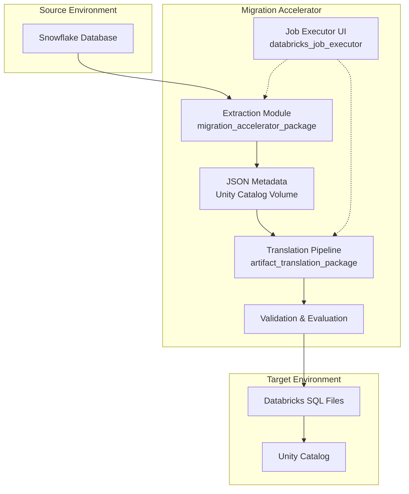
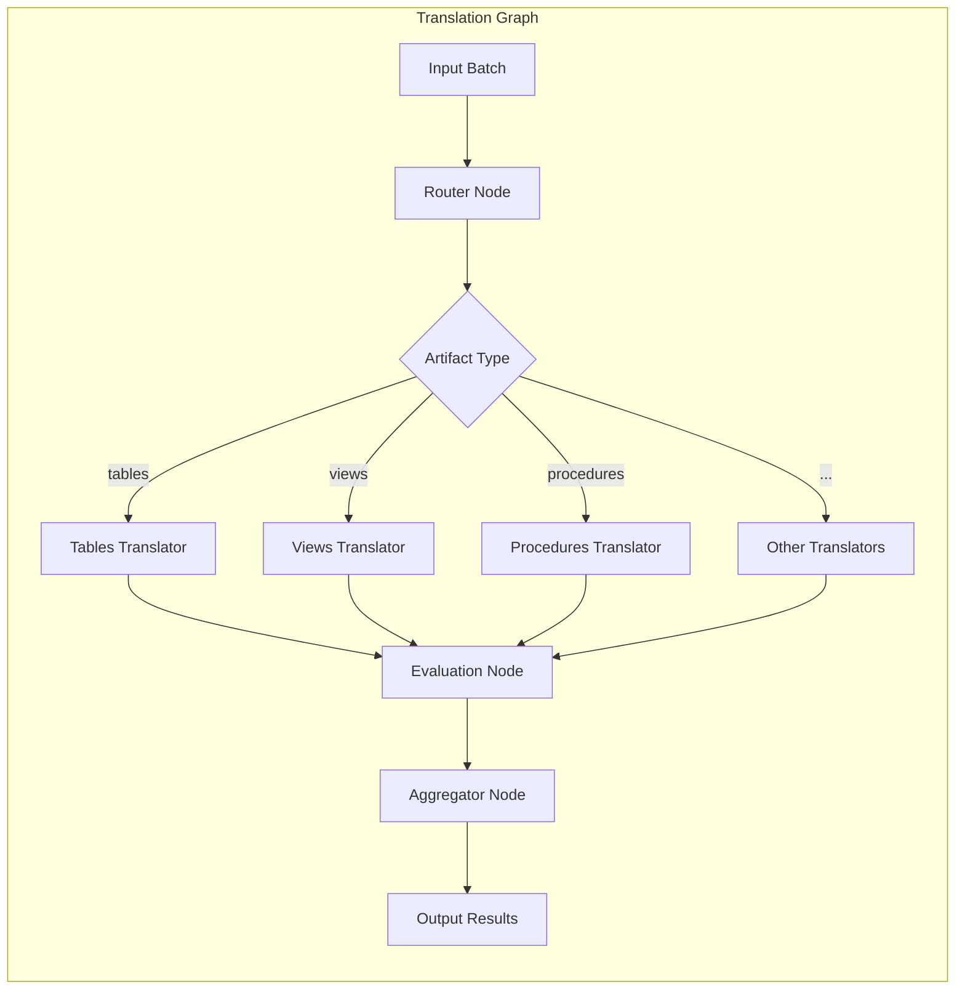
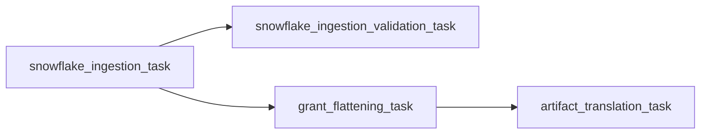
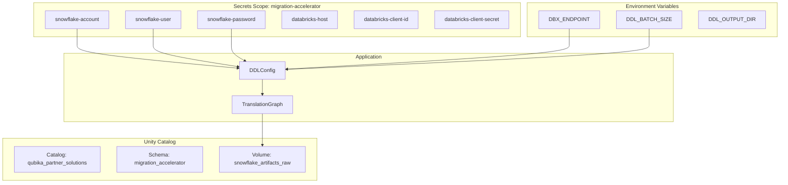
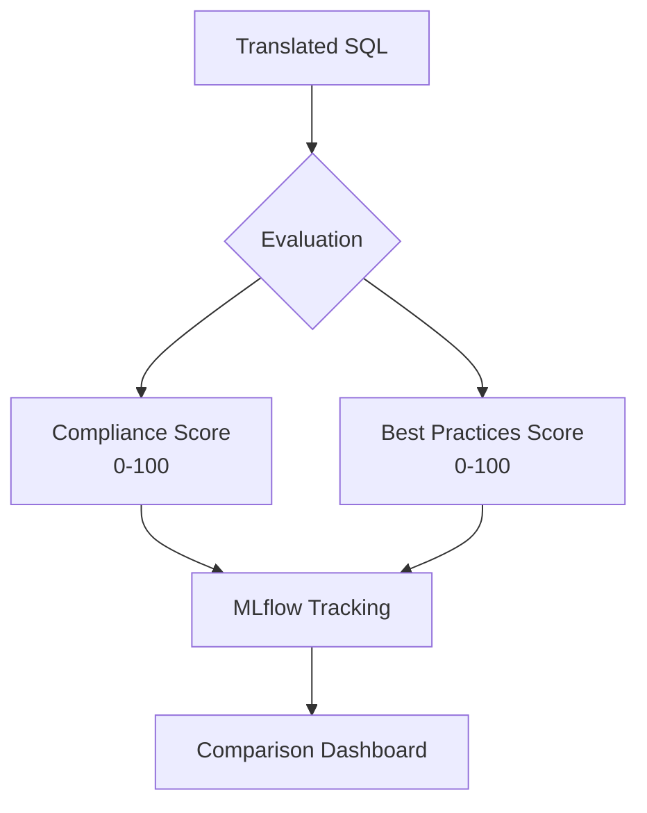

# Migration Accelerator Documentation

Welcome to the comprehensive documentation for the **Data Migration Accelerator**. This tool enables seamless migration of Snowflake database artifacts to Databricks using LLM-powered translation with built-in validation, observability, and benchmarking.

_Last updated by the team on January 5, 2026_

---

## Table of Contents

- [Overview](#overview)
- [Quick Start Guide](#quick-start-guide)
- [Architecture & Components](#architecture--components)
- [Setup & Installation Guide](#setup--installation-guide)
- [Runbook for Daily Operation](#runbook-for-daily-operation)
- [Evaluation & Benchmarking](#evaluation--benchmarking)
- [Troubleshooting & Support](#troubleshooting--support)
- [Client Onboarding Material](#client-onboarding-material)
- [Current Capabilities & Limitations](#current-capabilities--limitations)
- [Configuration Reference](#configuration-reference)

---

## Overview

The Migration Accelerator is an end-to-end solution for migrating Snowflake database artifacts to Databricks. It combines:

- **Automated Metadata Extraction**: Connects to Snowflake via Snowpark API to extract complete metadata for all database objects
- **LLM-Powered Translation**: Uses LangGraph orchestration with Databricks-hosted LLMs to translate Snowflake DDL to Databricks-compatible SQL
- **Built-in Validation**: Validates translations using SQLGlot syntax checking and LLM-based semantic evaluation
- **Observability & Benchmarking**: MLflow integration for tracking translation quality and comparing LLM models
- **UI-Based Execution**: Streamlit application for job execution and monitoring

### Supported Artifact Types

The accelerator supports **extraction** for all artifact types and **translation** for most. Some artifacts require manual review.

| Category | Artifact Types | Status |
|----------|---------------|--------|
| **Core Objects** | Tables, Views, Schemas, Databases | ✅ Full Translation |
| **Programmatic** | Procedures, Functions (UDFs) | ⚠️ Translation (Manual Review) |
| **Programmatic** | Sequences | ✅ Full Translation |
| **Data Pipeline** | Streams | ✅ Full Translation |
| **Data Pipeline** | Stages, Pipes | ⚠️ Translation (Manual Review) |
| **Data Pipeline** | Tasks, File Formats | 📥 Extraction Only |
| **Security** | Roles, Grants | ⚠️ Translation (Manual Review) |
| **Governance** | Tags, Comments, Masking Policies | ✅ Full Translation |
| **Governance** | External Locations | ⚠️ Translation (Manual Review) |

> [!NOTE]
> **Legend**: ✅ Full Translation = automated with sql_glot validation | ⚠️ Manual Review = translation available but sql_glot validation skipped | 📥 Extraction Only = metadata extracted, no translation

### Primary Execution Environment

> [!IMPORTANT]
> This tool is designed to run primarily on **Databricks Jobs** for production use. Local execution is supported for development and testing.

---

## Quick Start Guide

Get the Migration Accelerator running in 5 steps:

### Step 1: Clone the Repository
```bash
git clone https://github.com/your-org/data-migration-accelerator.git
cd data-migration-accelerator
```

### Step 2: Configure Environment
```bash
cp env.example .env
# Edit .env with your Snowflake and Databricks credentials
```

### Step 3: Install Dependencies
```bash
# Install Poetry (if not already installed)
pip install poetry

# Install project dependencies
poetry install
```
  

### Step 4: Run Translation
```bash
poetry run make translate
# Output: SQL files in src/artifact_translation_package/out_sql_examples_<timestamp>/
```

For production deployment on Databricks, see [Setup & Installation Guide](#setup--installation-guide).

---

## Architecture & Components

### High-Level Architecture



### Component Overview

The accelerator consists of four main packages:

| Package | Purpose | Key Files |
|---------|---------|-----------|
| `migration_accelerator_package` | Snowflake metadata extraction | `snowpark.py`, `artifact_readers.py` |
| `artifact_translation_package` | LLM-based translation pipeline | `graph_builder.py`, `main.py`, `nodes/` |
| `databricks_job_executor` | Streamlit UI for job management | `streamlit_app/app.py` |
| `evaluation` (subpackage) | MLflow benchmarking | `run_benchmark.py`, `model_benchmark.py` |

---

### Component 1: Extraction Module (`migration_accelerator_package`)

Extracts metadata from Snowflake using the Snowpark API.

**Features:**
- Connects to Snowflake with password authentication
- Extracts all artifact types (tables, views, procedures, functions, etc.)
- Retrieves DDL definitions and column metadata
- Outputs JSON files organized by artifact type
- Supports sample data extraction (first N rows)

**Key Classes:**
- `SnowparkObjectReader`: Main extraction class
- `ArtifactReaders`: Factory for reading specific artifact types
- `ArtifactValidators`: Validates extracted metadata

**Output Files:**
```
snowflake_artifacts_raw/
├── tables.json
├── views.json
├── procedures.json
├── functions.json
├── sequences.json
├── stages.json
├── file_formats.json
├── tasks.json
├── streams.json
├── pipelines.json
├── roles.json
├── grants_privileges.json
├── grants_hierarchy.json
├── grants_future.json
└── grants_flattened.json
```

---

### Component 2: Translation Pipeline (`artifact_translation_package`)

LangGraph-based orchestration for artifact translation.

**Architecture:**



**Key Components:**

| Component | Description |
|-----------|-------------|
| **Router** (`nodes/router.py`) | Determines artifact type and routes to appropriate translator |
| **Translation Nodes** (`nodes/*_translation.py`) | Type-specific translation logic using LLM prompts |
| **Evaluation Node** (`nodes/evaluation.py`) | SQLGlot syntax validation |
| **Aggregator** (`nodes/aggregator.py`) | Collects and merges all translation results |
| **Prompts** (`prompts/*.py`) | Specialized prompts for each artifact type |

**Supported Translators:**
- Databases, Schemas, Tables, Views
- Procedures, UDFs, Stages, Streams, Pipes
- Roles, Grants, Tags, Comments
- Masking Policies, External Locations

**Processing Flow:**
1. **Batch Creation**: Input JSON split into configurable batch sizes
2. **Routing**: Each batch routed to appropriate translator
3. **Translation**: LLM generates Databricks-compatible DDL
4. **Evaluation**: Syntax validation via SQLGlot
5. **Aggregation**: Results merged into final output

---

### Component 3: Job Executor UI (`databricks_job_executor`)

Streamlit application for Databricks job execution and monitoring.

**Features:**
- Execute configured Databricks migration jobs
- Real-time job run monitoring
- View job logs and diagnostics (multi-task support)
- Cancel running jobs
- Connection status display

**Deployment Options:**
1. **Local**: `streamlit run databricks_job_executor/streamlit_app/app.py`
2. **Databricks App**: Deploy via Databricks Asset Bundles

---

### Component 4: Evaluation & Benchmarking (`evaluation`)

MLflow-based evaluation for comparing translation quality across models.

**Features:**
- LLM-as-judge evaluation
- Compliance scoring (functional correctness)
- Best practices scoring (performance & documentation)
- Multi-model comparison
- MLflow experiment tracking

**Evaluation Dimensions:**

| Dimension | Goal | Scoring |
|-----------|------|---------|
| **Compliance** | Functional correctness | 0-100 (deduction-based) |
| **Best Practices** | Performance & documentation | 0-100 (deduction-based) |

---

## Setup & Installation Guide

This guide provides step-by-step instructions to configure the Migration Accelerator in a Databricks workspace.

### Prerequisites

- [ ] Databricks workspace with admin access
- [ ] Snowflake account with appropriate permissions (SYSADMIN recommended)
- [ ] Python 3.12+ environment (for local development)
- [ ] Databricks CLI installed and configured
- [ ] Access to Databricks-hosted LLMs (Foundation Model APIs)

---

### Step 1: Configure Unity Catalog Resources

Create the required Unity Catalog resources for storing artifacts.

#### Option A: Using Databricks Asset Bundles (Recommended)

The project includes pre-configured Unity Catalog resources in `resources/unity_catalog.yml`:

```bash
# From project root
databricks bundle deploy -t dev
```

This creates:
- **Catalog**: `qubika_partner_solutions` (configurable)
- **Schema**: `migration_accelerator`
- **Volume**: `snowflake_artifacts_raw`

#### Option B: Manual Creation

```sql
-- Create catalog (if not exists)
CREATE CATALOG IF NOT EXISTS qubika_partner_solutions;

-- Create schema
CREATE SCHEMA IF NOT EXISTS qubika_partner_solutions.migration_accelerator
COMMENT 'Contains Unity Catalog resources for Migration Accelerator';

-- Create volume for raw artifacts
CREATE VOLUME IF NOT EXISTS qubika_partner_solutions.migration_accelerator.snowflake_artifacts_raw
COMMENT 'Contains extracted Snowflake artifacts in JSON format';

-- Grant permissions to developers
GRANT ALL PRIVILEGES ON SCHEMA qubika_partner_solutions.migration_accelerator 
TO `migration-accelerator-devs`;
```

---

### Step 2: Configure Databricks Cluster

Create or configure a cluster with the following specifications:

| Setting | Recommended Value |
|---------|-------------------|
| **Databricks Runtime** | 14.3 LTS or later (Python 3.12+) |
| **Node Type** | `i3.xlarge` or equivalent |
| **Cluster Mode** | Single node (testing) or multi-node (production) |
| **Access Mode** | Single user or Shared |

#### Required Libraries

Install via cluster libraries (Compute → Libraries → Install New):

```
snowflake-connector-python>=3.0.0
snowflake-snowpark-python>=1.0.0
langchain>=0.1.0
langchain-core>=0.1.0
langchain-community>=0.1.0
langgraph>=0.1.0
sqlglot>=20.0.0
pydantic>=2.0.0
python-dotenv>=1.0.0
databricks-sdk>=0.1.0
databricks-langchain>=0.1.0
mlflow>=2.10.0
```

Or use an init script:
```bash
#!/bin/bash
pip install snowflake-connector-python snowflake-snowpark-python langchain langchain-core langchain-community langgraph sqlglot pydantic python-dotenv databricks-sdk databricks-langchain mlflow
```

---

### Step 3: Set Up Databricks Secrets

Create a secret scope and add required secrets.

```bash
# Create secret scope
databricks secrets create-scope migration-accelerator

# Add Snowflake secrets
databricks secrets put-secret migration-accelerator snowflake-account
databricks secrets put-secret migration-accelerator snowflake-user
databricks secrets put-secret migration-accelerator snowflake-password

# Add Databricks OAuth M2M secrets (Service Principal)
databricks secrets put-secret migration-accelerator databricks-host
databricks secrets put-secret migration-accelerator databricks-client-id
databricks secrets put-secret migration-accelerator databricks-client-secret

# Add LLM endpoint (optional - has default)
databricks secrets put-secret migration-accelerator dbx-endpoint

# Add LangSmith secrets (optional - for tracing)
databricks secrets put-secret migration-accelerator langsmith-endpoint
databricks secrets put-secret migration-accelerator langsmith-api-key
```

#### Secrets Reference

| Secret Key | Description | Required |
|------------|-------------|----------|
| `snowflake-account` | Snowflake account URL (e.g., `xy12345.us-east-1`) | Yes |
| `snowflake-user` | Snowflake username | Yes |
| `snowflake-password` | Snowflake password | Yes |
| `databricks-host` | Databricks workspace URL | Yes |
| `databricks-client-id` | OAuth M2M client ID (Service Principal) | Yes |
| `databricks-client-secret` | OAuth M2M client secret | Yes |
| `dbx-endpoint` | LLM endpoint name | No (default: `databricks-llama-4-maverick`) |
| `langsmith-endpoint` | LangSmith API endpoint | No |
| `langsmith-api-key` | LangSmith API key | No |

---

### Step 4: Configure Environment Variables

Environment variables can be set at cluster level, job level, or via `.env` file.

#### For Databricks Jobs

Set in job configuration under "Environment variables":

```bash
# Core settings
ENVIRONMENT=production
DBX_ENDPOINT=databricks-llama-4-maverick

# Processing settings
DDL_BATCH_SIZE=8
DDL_OUTPUT_FORMAT=sql
DDL_OUTPUT_DIR=/Volumes/qubika_partner_solutions/migration_accelerator/outputs

# Unity Catalog paths (if overriding defaults)
UC_CATALOG=qubika_partner_solutions
UC_SCHEMA=migration_accelerator
UC_RAW_VOLUME=snowflake_artifacts_raw
```

#### For Local Development

Create a `.env` file from the example:

```bash
cp env.example .env
```

Edit with your credentials:
```env
# Snowflake Connection
SNOWFLAKE_ACCOUNT=your-account.snowflakecomputing.com
SNOWFLAKE_USER=your_username
SNOWFLAKE_PASSWORD=your_password
SNOWFLAKE_DATABASE=your_database
SNOWFLAKE_SCHEMA=your_schema
SNOWFLAKE_ROLE=SYSADMIN
SNOWFLAKE_WAREHOUSE=COMPUTE_WH

# Databricks Connection (OAuth M2M - Service Principal)
DATABRICKS_HOST=https://your-workspace.cloud.databricks.com
DATABRICKS_CLIENT_ID=your_client_id
DATABRICKS_CLIENT_SECRET=your_client_secret

# LLM Configuration
DBX_ENDPOINT=databricks-llama-4-maverick
```

---

### Step 5: Deploy Databricks Jobs

The project uses Databricks Asset Bundles for deployment.

#### Job Configuration

The main ingestion job (`resources/jobs.yml`) includes 4 tasks:



| Task | Entry Point | Description |
|------|-------------|-------------|
| `snowflake_ingestion_task` | `snowpark-reader` | Extract Snowflake metadata |
| `snowflake_ingestion_validation_task` | `snowflake-validator` | Validate extracted metadata |
| `grant_flattening_task` | `grant-transformer` | Flatten grant hierarchies |
| `artifact_translation_task` | `translation-module` | Translate artifacts to Databricks SQL |

#### Deploy the Bundle

```bash
# Validate configuration
databricks bundle validate

# Deploy to development target
databricks bundle deploy -t dev

# Run the job
databricks bundle run snowflake_ingestion_job -t dev
```

#### CI/CD Pipeline (Automated Deployment)

The project includes a GitHub Actions CI/CD pipeline for automated deployment:

**Workflow File**: `.github/workflows/databricks-asset-bundle-deploy.yml`

**Triggers**:
- Push to `main` or `develop` branches
- Pull requests to `main` or `develop` branches
- Manual workflow dispatch

**Pipeline Steps**:
1. Checkout code
2. Set up Python 3.12 and Poetry
3. Install project dependencies
4. Install Databricks CLI
5. Validate bundle configuration
6. Deploy bundle to dev environment
7. Run the Databricks Job Executor app
8. Display bundle summary and resources

**Required GitHub Secrets**:
- `DATABRICKS_HOST`: Databricks workspace URL
- `DATABRICKS_CLIENT_ID`: OAuth M2M client ID
- `DATABRICKS_CLIENT_SECRET`: OAuth M2M client secret
- `DATABRICKS_CLUSTER_ID`: Cluster ID for job execution (DAB variable)
- `UC_CATALOG`: Unity Catalog name (DAB variable)
- `DEVS_GROUP`: Group name for permissions (DAB variable)

> [!NOTE]
> The `DEVS_GROUP` (e.g., `migration-accelerator-devs`) must exist in Databricks before deployment. Create it in **Admin Console → Groups → Create Group**.

**Authentication**: Uses OAuth machine-to-machine (M2M) authentication for secure, token-less deployment.

**To set up CI/CD**:
1. Configure the required secrets in GitHub repository settings
2. Push to `main` or `develop` branch to trigger deployment
3. Monitor workflow progress in GitHub Actions tab

---

### Step 6: Deploy Job Executor App (Optional)

For UI-based job management:

```bash
cd databricks_job_executor

# Deploy the Streamlit app
databricks bundle deploy -t dev
```

Access the app from Databricks workspace → Apps section.

---

### Step 7: Verify Configuration

Run these verification steps:

#### Test Snowflake Connection
```python
from snowflake.snowpark import Session

connection_parameters = {
    "account": "your-account",
    "user": "your-user",
    "password": "your-password",
    "database": "your-database",
    "schema": "your-schema"
}
session = Session.builder.configs(connection_parameters).create()
print(f"Connected to: {session.get_current_database()}")
```

#### Test Databricks Connection
```python
from databricks.sdk import WorkspaceClient

w = WorkspaceClient()
print(f"Current user: {w.current_user.me().user_name}")
```

#### Test LLM Endpoint
```python
from databricks_langchain import ChatDatabricks

llm = ChatDatabricks(endpoint="databricks-llama-4-maverick")
response = llm.invoke("Say hello")
print(response.content)
```

---

### Configuration Diagram



---

## Runbook for Daily Operation

This runbook details operational workflows for running the Migration Accelerator.

### Execution Modes

| Mode | Use Case | Setup |
|------|----------|-------|
| **Databricks Jobs** | Production, scheduled runs | Deploy via Asset Bundles |
| **Interactive/Local** | Development, testing | Run Python scripts locally |

---

### Workflow 1: Metadata Extraction

Extract Snowflake metadata to JSON files.

#### Via Databricks Jobs (Production)

```bash
# Run the ingestion task
databricks jobs run-now --job-id <JOB_ID>

# Or via bundle
databricks bundle run snowflake_ingestion_job -t dev
```

**Task**: `snowflake_ingestion_task`  
**Entry Point**: `snowpark-reader`  
**Output**: JSON files in `snowflake_artifacts_raw` volume

#### Via Local Execution (Development)

```bash
# Run extraction with Poetry
poetry run python snowpark.py
```

**Output**: `snowflake_objects_snowpark.json` in current directory

#### Parameters

| Parameter | Environment Variable | Default |
|-----------|---------------------|---------|
| Database | `SNOWFLAKE_DATABASE` | `LVDMS` |
| Schema | `SNOWFLAKE_SCHEMA` | `LVDMS` |
| Role | `SNOWFLAKE_ROLE` | `SYSADMIN` |
| Warehouse | `SNOWFLAKE_WAREHOUSE` | `COMPUTE_WH` |

---

### Workflow 2: Grant Transformation

Flatten grant hierarchies for easier translation.

#### Via Databricks Jobs

**Task**: `grant_flattening_task`  
**Entry Point**: `grant-transformer`  
**Depends On**: `snowflake_ingestion_task`

#### Programmatic Usage

```python
from migration_accelerator_package.grant_transformer import GrantTransformer

transformer = GrantTransformer(grants_data)
flattened = transformer.flatten()
```

**Output**: `grants_flattened.json`

---

### Workflow 3: Artifact Translation

Translate Snowflake DDL to Databricks-compatible SQL.

#### Via Databricks Jobs

**Task**: `artifact_translation_task`  
**Entry Point**: `translation-module`  
**Depends On**: `grant_flattening_task`

#### Via Local Execution

**Option 1: Using Make (Recommended)**
```bash
make translate
```

**Option 2: Using run script**
```bash
./scripts/run_translation.sh "path/to/input/*.json" 4 sql
```

**Option 3: Direct Python execution**
```bash
poetry run python -m artifact_translation_package.main \
  path/to/tables.json \
  path/to/views.json \
  --batch-size 5 \
  --output ./output \
  --output-format combined
```

#### Parameters

| Parameter | CLI Flag | Environment Variable | Default |
|-----------|----------|---------------------|---------|
| Batch Size | `--batch-size` | `DDL_BATCH_SIZE` | `8` |
| Output Format | `--output-format` | `DDL_OUTPUT_FORMAT` | `sql` |
| Output Directory | `--output` | `DDL_OUTPUT_DIR` | `/Volumes/.../outputs` |
| LLM Endpoint | - | `DBX_ENDPOINT` | `databricks-llama-4-maverick` |
| Temperature | - | `DDL_TEMPERATURE` | `0.1` |
| Max Tokens | - | `DDL_MAX_TOKENS` | `2000` |

#### Output Formats

| Format | Description | Files Created |
|--------|-------------|---------------|
| `sql` | SQL files only | `tables.sql`, `views.sql`, etc. |
| `json` | JSON results | `translation_results.json` |
| `combined` | Both SQL and JSON | All of the above |

---

### Workflow 4: Validation & Evaluation

Validate translated SQL for syntax and semantic correctness.

#### Automatic Validation

Validation runs automatically after translation:
- **SQLGlot**: Syntax validation for all artifacts
- **LLM Evaluation**: Semantic validation for complex artifacts (procedures, pipes)

#### Manual Evaluation via Benchmark

```bash
python3 run_local_benchmark.py \
  --artifact-type tables \
  --models databricks-llama-4-maverick databricks-gemini-2-5-flash
```

See [Evaluation & Benchmarking](#evaluation--benchmarking) for details.

---

### Output Directory Structure

```
output_directory/
├── databases.sql           # Database DDL
├── schemas.sql             # Schema DDL
├── tables.sql              # Table DDL
├── views.sql               # View DDL
├── procedures.sql          # Procedure DDL
├── functions.sql           # UDF DDL
├── stages.sql              # Stage DDL
├── streams.sql             # Stream DDL
├── pipes.sql               # Pipe DDL
├── roles.sql               # Role DDL
├── grants.sql              # Grant statements
├── translation_results.json    # Full results with metadata
├── results_summary.json        # Summary statistics
└── evaluation_results/
    └── evaluation_batch_*.json # Validation results per batch
```

---

### Common Workflow Paths

| Workflow | Steps | Use Case |
|----------|-------|----------|
| **Full Migration** | Extract → Validate → Transform → Translate → Validate | Complete migration |
| **Incremental Update** | Extract (subset) → Translate → Validate | Add new tables/views |
| **Translation Only** | Translate (existing JSON) → Validate | Re-run with different LLM |
| **Benchmark** | Translate → Benchmark multiple models | Compare model quality |

---

## Evaluation & Benchmarking

The evaluation module uses MLflow and LLM-as-judge to assess translation quality.

### Overview

The benchmark evaluates translations across two dimensions:



### Running Benchmarks

#### Command Line

```bash
# Basic: Single artifact type
python3 run_local_benchmark.py --artifact-type tables

# Compare multiple models
python3 run_local_benchmark.py \
  --artifact-type views \
  --models databricks-llama-4-maverick databricks-meta-llama-3-1-70b-instruct

# Custom input data
python3 run_local_benchmark.py \
  --artifact-type tables \
  --dataset-source /path/to/your/metadata.json

# Adjust batch size
python3 run_local_benchmark.py --batch-size 10
```

#### Interactive Notebook

Open `src/artifact_translation_package/evaluation/benchmark_interactive.ipynb`:

```python
# Configure models
TRANSLATION_MODELS = ["databricks-llama-4-maverick", "databricks-gemini-2-5-flash"]
ARTIFACT_TYPE = "tables"

# Run benchmark and visualize results
```

### Scoring System

#### Compliance Score (0-100)

Measures functional correctness. Starting from 100, points are deducted for issues:

| Issue | Deduction | Description |
|-------|-----------|-------------|
| Invalid syntax | 100 pts | Score becomes 0 |
| Missing `USING DELTA` | 20 pts | Tables should specify Delta format |
| Legacy types (`VARCHAR`, `TEXT`) | 10 pts | Should use `STRING` |
| Missing 3-level naming | 15 pts | Should use `catalog.schema.table` |

#### Best Practices Score (0-100)

Measures optimization and documentation quality:

| Issue | Deduction | Description |
|-------|-----------|-------------|
| Missing `CLUSTER BY` | 30 pts | Liquid Clustering recommended |
| Missing table properties | 20 pts | `autoOptimize`, etc. |
| Missing table `COMMENT` | 25 pts | Documentation |
| Missing column `COMMENT`s | 25 pts | Documentation |

### MLflow Integration

The benchmark automatically logs to MLflow:

- **Experiment Name**: `sql-translation-benchmark` (configurable)
- **Run Parameters**: Model name, temperature, artifact type
- **Metrics**: `avg_compliance`, `avg_best_practices`, `syntax_valid_pct`
- **Artifacts**: `issues_table.json`, `top_issues_summary.txt`
- **Tags**: Issue categories for searchability

### Metrics Reference

| Metric | Range | Description |
|--------|-------|-------------|
| `avg_compliance` | 0-100 | Mean functional correctness score |
| `avg_best_practices` | 0-100 | Mean optimization/documentation score |
| `compliant_pct` | 0-100% | Percentage of statements scoring ≥70 |
| `syntax_valid_pct` | 0-100% | Percentage with valid Databricks SQL syntax |

### Configuring Judge Model

The judge model (used for evaluation) can be configured separately from translation models:

```python
# In ddl_config.py
"benchmark": {
    "judge_endpoint": "databricks-llama-4-maverick",
    ...
}
```

Or via environment:
```bash
export DDL_JUDGE_ENDPOINT=databricks-llama-4-maverick
```

---

## Troubleshooting & Support

### Common Errors

#### Snowflake Connection Errors

**Error**: `Snowflake connection failed` or `Invalid credentials`

**Causes & Solutions**:
| Cause | Solution |
|-------|----------|
| Invalid credentials | Verify `SNOWFLAKE_USER` and `SNOWFLAKE_PASSWORD` in secrets |
| Account URL format | Use format `xy12345.us-east-1` (not full URL) |
| Network issues | Check VPC/firewall allows Snowflake access |
| Role permissions | Ensure role has `SYSADMIN` or equivalent access |

**Verification**:
```python
from snowflake.snowpark import Session
session = Session.builder.configs({
    "account": "your-account",
    "user": "your-user",
    "password": "your-password"
}).create()
```

---

#### Databricks Authentication Errors

**Error**: `Databricks authentication failed` or `401 Unauthorized`

**Solutions**:
1. Verify OAuth M2M credentials (client_id and client_secret) are correct
2. Verify Service Principal has required permissions:
   - Workspace access
   - Cluster access
   - Jobs access (for job execution)
   - Unity Catalog access
3. Check secrets are configured correctly:
   ```bash
   databricks secrets get-secret migration-accelerator databricks-client-id
   databricks secrets get-secret migration-accelerator databricks-client-secret
   ```
4. Ensure the Service Principal is added to the workspace

---

#### LLM Endpoint Errors

**Error**: `Model not found` or `Endpoint unavailable`

**Solutions**:
1. Verify endpoint name in Databricks Model Serving UI
2. Check endpoint status (must be "Ready")
3. Verify permissions to access the endpoint
4. Try alternative endpoint: `databricks-meta-llama-3-1-70b-instruct`

**Common Endpoints**:
- `databricks-llama-4-maverick`
- `databricks-meta-llama-3-1-70b-instruct`
- `databricks-gemini-2-5-flash`

---

#### Unity Catalog Access Errors

**Error**: `Access denied to catalog/schema/volume`

**Solutions**:
1. Grant required permissions:
```sql
GRANT ALL PRIVILEGES ON CATALOG qubika_partner_solutions TO `your-user`;
GRANT ALL PRIVILEGES ON SCHEMA migration_accelerator TO `your-user`;
```
2. Verify catalog exists and is accessible
3. Check volume path format: `/Volumes/<catalog>/<schema>/<volume>/`

---

#### Translation Failures

**Error**: `Translation failed for artifact X`

**Diagnostic Steps**:
1. Check `translation_results.json` for error details
2. Review `evaluation_results/` for validation failures
3. Check input JSON format matches expected schema
4. Verify artifact type is supported

**Common Issues**:
| Issue | Solution |
|-------|----------|
| Empty DDL | Check Snowflake extraction result |
| Complex procedure | May need manual adjustment |
| Unsupported syntax | See [Release Notes](#release-notes) for limitations |

---

#### Memory/Timeout Issues

**Error**: `Out of memory` or `Timeout exceeded`

**Solutions**:
1. Reduce batch size: `DDL_BATCH_SIZE=4`
2. Increase cluster memory/nodes
3. Increase timeout: `DDL_TIMEOUT=600`
4. Process fewer artifacts per run

---

### Reading Logs

#### Log Locations

| Environment | Location |
|-------------|----------|
| Databricks Jobs | Job run details → Logs tab |
| Local execution | Console output + log files |
| Cluster logs | DBFS: `/cluster-logs/<cluster-id>/` |

#### Log Levels

Set via `DDL_LOG_LEVEL` or `LOG_LEVEL`:
- `DEBUG`: Detailed debugging information
- `INFO`: General progress information (default)
- `WARN`: Warning messages
- `ERROR`: Error messages only

#### Log Format

```json
{
  "timestamp": "2026-01-05T10:00:00Z",
  "level": "INFO",
  "run_id": "abc123",
  "message": "Processing batch 1/10 for tables",
  "artifact_type": "tables",
  "batch_size": 8
}
```

---

### Reviewing Validation Reports

**Location**: `<output_dir>/evaluation_results/`

**Report Structure**:
```json
{
  "batch": {
    "artifact_type": "tables",
    "evaluated_count": 5
  },
  "validation": {
    "total_statements": 5,
    "valid_statements": 4,
    "invalid_statements": 1,
    "validation_method": "syntax_validator"
  },
  "results": [
    {
      "artifact_name": "my_table",
      "is_valid": true,
      "syntax_errors": [],
      "warnings": []
    }
  ],
  "timestamp": "20260105_100000"
}
```

---

### Identifying Problematic Artifacts

1. **Check summary**: Review `results_summary.json` for failed count
2. **Filter failures**: Look for `"is_valid": false` in evaluation results
3. **Review errors**: Check `syntax_errors` array for specific issues
4. **Check original**: Compare translated SQL against original Snowflake DDL

---

### Escalation Paths

1. **Self-Service**: Check this documentation and FAQs
2. **Team Support**: Contact engineering team with:
   - Run ID
   - Error logs
   - Input artifacts
   - Environment details
3. **Critical Issues**: Response within 24 hours for production blockers

**Information to Include**:
- Run ID or Job Run ID
- Error message and stack trace
- Artifact type(s) affected
- Environment (Databricks/Local)
- Configuration settings

---

## Client Onboarding Material


### Client Responsibilities vs Accelerator Behavior

| Responsibility | Client | Accelerator |
|----------------|--------|-------------|
| **Snowflake Access** | Provide credentials | Connect and extract |
| **Databricks Setup** | Provide workspace | Use for processing |
| **Input Accuracy** | Ensure source DDL is valid | Extract as-is |
| **Translation** | Review outputs | Generate Databricks SQL |
| **Validation** | Final review and testing | Syntax and semantic checks |
| **Deployment** | Execute in target environment | Produce ready-to-run SQL |
| **Unsupported Features** | Manual handling | Flag in reports |

---

### Overview Content

#### What is Migration Accelerator?
- Automated tool for Snowflake → Databricks migration
- Uses LLM-powered translation for complex artifacts
- Provides end-to-end workflow from extraction to deployment-ready SQL

#### Key Features
- Supports 15+ Snowflake artifact types
- Built-in validation with SQLGlot and LLM evaluation
- Databricks-native integration (Unity Catalog, Jobs, Model Serving)
- Comprehensive reporting and observability

#### Workflow Summary
```
Snowflake → Extract Metadata → Transform → Translate with LLM → Validate → Databricks SQL
```

---

### FAQs

**Q: What artifacts are supported?**
A: Tables, views, procedures, functions (UDFs), sequences, stages, file formats, tasks, streams, pipes, roles, grants, tags, comments, masking policies, and external locations.

**Q: How long does migration take?**
A: Depends on volume:
- Small (< 100 objects): Minutes
- Medium (100-1000 objects): 30-60 minutes
- Large (1000+ objects): Hours

**Q: What if translation fails?**
A: Check logs and validation reports. Common resolutions:
1. Review original DDL for unsupported syntax
2. Reduce complexity (split large objects)
3. Manual adjustment for edge cases

**Q: Can I customize the LLM prompts?**
A: Yes, prompts are in `src/artifact_translation_package/prompts/`. Modify for specific requirements.

**Q: Which LLM models are supported?**
A: Any Databricks-hosted model via Model Serving, including:
- `databricks-llama-4-maverick` (default)
- `databricks-meta-llama-3-1-70b-instruct`
- `databricks-gemini-2-5-flash`

**Q: How do I handle unsupported features?**
A: The accelerator flags unsupported constructs. Manual translation required for:
- Snowflake-specific UDF syntax
- Complex procedural logic
- External integrations (AWS/Azure specific stages)

**Q: Is there production support?**
A: Support expectations:
- Critical issues: Response within 24 hours
- Standard issues: Response within 48-72 hours
- Provide run ID and logs for faster resolution

---

### Glossary

| Term | Definition |
|------|------------|
| **Artifact** | A database object (table, view, procedure, etc.) |
| **DDL** | Data Definition Language - SQL statements for creating/modifying schema objects |
| **Delta / Delta Lake** | Databricks' optimized storage format with ACID transactions |
| **LangGraph** | Framework for building stateful, multi-step LLM workflows |
| **LLM** | Large Language Model - AI model for natural language and code generation |
| **MLflow** | Platform for ML lifecycle management, used for tracking experiments |
| **Snowflake** | Cloud data platform - the source system for migration |
| **Snowpark** | Snowflake's Python API for data processing |
| **SQLGlot** | SQL parser/transpiler used for syntax validation |
| **Unity Catalog** | Databricks' unified governance solution for data and AI |
| **Volume** | Unity Catalog managed storage, similar to DBFS |

---

## Current Capabilities & Limitations

This section describes the current state of the Migration Accelerator, including what is supported, what has limitations, and what features are being planned.

### Current Features

- **End-to-End Migration Pipeline**
  - Snowflake metadata extraction via Snowpark API
  - LLM-powered translation to Databricks SQL
  - Automated syntax validation with SQLGlot
  - LLM-based semantic evaluation

- **Comprehensive Artifact Support**
  - Core: Tables, Views, Schemas, Databases
  - Programmatic: Procedures, Functions, Sequences
  - Data Pipeline: Stages, Streams, Pipes, Tasks, File Formats
  - Security: Roles, Grants (Privileges, Hierarchy, Future)
  - Governance: Tags, Comments, Masking Policies, External Locations

- **Databricks Integration**
  - Unity Catalog native storage
  - Databricks Asset Bundles deployment
  - Model Serving LLM integration
  - MLflow experiment tracking
  - GitHub Actions CI/CD pipeline for automated deployment

- **Observability**
  - Structured logging with run IDs
  - Validation reports per batch
  - Summary statistics
  - LangSmith tracing support (optional)

- **User Interface**
  - Streamlit Job Executor app
  - Real-time job monitoring
  - Log viewing and diagnostics

- **Benchmarking**
  - Multi-model comparison
  - Compliance and best practices scoring
  - MLflow integration for tracking

### Artifact Support Matrix

| Artifact Type | Extraction | Translation | Validation | Notes |
|---------------|------------|-------------|------------|-------|
| Tables | ✅ | ✅ Full | ✅ SQLGlot | Delta format with liquid clustering |
| Views | ✅ | ✅ Full | ✅ SQLGlot | Materialized view conversion |
| Schemas | ✅ | ✅ Full | ✅ SQLGlot | Schema creation |
| Databases | ✅ | ✅ Full | ✅ SQLGlot | Catalog mapping |
| Sequences | ✅ | ✅ Full | ✅ SQLGlot | Identity column conversion |
| Streams | ✅ | ✅ Full | ✅ SQLGlot | CDC pattern translation |
| Tags | ✅ | ✅ Full | ✅ SQLGlot | Tag propagation |
| Comments | ✅ | ✅ Full | ✅ SQLGlot | Comment preservation |
| Masking Policies | ✅ | ✅ Full | ✅ SQLGlot | Row-level security |
| Procedures | ✅ | ⚠️ Available | ❌ Skip | Complex logic - manual review required |
| Functions (UDFs) | ✅ | ⚠️ Available | ❌ Skip | Some syntax limitations - manual review |
| Stages | ✅ | ⚠️ Available | ❌ Skip | Cloud-specific - manual review |
| Pipes | ✅ | ⚠️ Available | ❌ Skip | Auto Loader conversion - manual review |
| Roles | ✅ | ⚠️ Available | ❌ Skip | Unity Catalog groups - manual review |
| Grants | ✅ | ⚠️ Available | ❌ Skip | Permission model differences - manual |
| External Locations | ✅ | ⚠️ Available | ⚠️ Manual | Cloud-specific configuration |
| Tasks | ✅ | ❌ Not Yet | N/A | Extraction only - planned enhancement |
| File Formats | ✅ | ❌ Not Yet | N/A | Extraction only - planned enhancement |

**Legend**:
- ✅ Full = Fully automated and validated
- ⚠️ Available/Skip = Translation available but validation skipped, requires manual review
- ❌ = Not available or skipped

### Known Limitations

1. **Extraction-Only Artifacts**: Tasks and File Formats are extracted but not yet translated - requires manual conversion
2. **Validation-Skipped Artifacts**: Procedures, UDFs, Stages, Pipes, Roles, and Grants have translation available but validation is skipped - requires manual review
3. **Complex Procedural Logic**: Procedures with advanced Snowflake-specific constructs may require manual adjustment
4. **External Stages**: AWS/Azure/GCP-specific stages need cloud configuration review
5. **Real-Time Migration**: This tool handles metadata/DDL only, not data migration
6. **Large Datasets**: Very large schemas (10,000+ objects) may require batching strategies
7. **LLM Variability**: Translation quality depends on model capability and temperature settings

### Unsupported Features

- **Tasks**: Snowflake Tasks → Databricks Workflows (extraction only, manual translation required)
- **File Formats**: Snowflake File Formats (extraction only, manual mapping to Databricks)
- Snowflake external functions (require separate integration)
- Time travel queries (need adaptation for Delta time travel)
- Some advanced UDF syntax (Java/Scala UDFs in Snowflake)
- Reader accounts (Snowflake-specific)
- Data shares (require Databricks-specific setup)


---

## Configuration Reference

### Environment Variables

> [!IMPORTANT]
> Variables marked as **Required** have no defaults in the code and must be explicitly set in your cluster configuration or `.env` file.

#### Core Settings

| Variable | Description | Default | Required |
|----------|-------------|---------|----------|
| `ENVIRONMENT` | Execution environment | `development` | No |
| `DBX_ENDPOINT` | LLM endpoint name | `databricks-llama-4-maverick` | No |
| `LOG_LEVEL` | Logging level | `INFO` | No |

#### Snowflake Connection

| Variable | Description | Default | Required |
|----------|-------------|---------|----------|
| `SNOWFLAKE_ACCOUNT` | Account identifier | - | **Yes** |
| `SNOWFLAKE_USER` | Username | - | **Yes** |
| `SNOWFLAKE_PASSWORD` | Password | - | **Yes** |
| `SNOWFLAKE_DATABASE` | Database name | - | **Yes** |
| `SNOWFLAKE_SCHEMA` | Schema name | - | **Yes** |
| `SNOWFLAKE_ROLE` | Role | `SYSADMIN` | No |
| `SNOWFLAKE_WAREHOUSE` | Warehouse | `COMPUTE_WH` | No |

#### Databricks Connection

| Variable | Description | Default | Required |
|----------|-------------|---------|----------|
| `DATABRICKS_HOST` | Workspace URL | - | **Yes** |
| `DATABRICKS_CLIENT_ID` | OAuth M2M client ID | - | **Yes** |
| `DATABRICKS_CLIENT_SECRET` | OAuth M2M client secret | - | **Yes** |
| `DATABRICKS_JOB_ID` | Job ID for executor | - | No |

#### Unity Catalog (Required)

| Variable | Description | Default | Required |
|----------|-------------|---------|----------|
| `UC_CATALOG` | Catalog name | - | **Yes** |
| `UC_SCHEMA` | Schema name | - | **Yes** |
| `UC_RAW_VOLUME` | Raw volume name | `snowflake_artifacts_raw` | No |
| `SECRETS_SCOPE` | Databricks secrets scope | `migration-accelerator` | No |

#### Processing Settings

| Variable | Description | Default |
|----------|-------------|---------|
| `DDL_BATCH_SIZE` | Artifacts per batch | `8` |
| `DDL_MAX_CONCURRENT` | Concurrent batches | `5` |
| `DDL_TIMEOUT` | Timeout in seconds | `300` |
| `DDL_TEMPERATURE` | LLM temperature | `0.1` |
| `DDL_MAX_TOKENS` | Max LLM tokens | `2000` |

#### Output Settings

| Variable | Description | Default |
|----------|-------------|---------|
| `DDL_OUTPUT_DIR` | Output directory | - (generated from UC config) |
| `DDL_OUTPUT_FORMAT` | Format: sql, json, combined | `sql` |
| `DDL_INCLUDE_METADATA` | Include metadata | `true` |
| `DDL_COMPRESS_OUTPUT` | Compress files | `false` |
| `LOCAL_DBFS_MOUNT` | Local DBFS mapping | `./ddl_output` |

#### Observability

| Variable | Description | Default |
|----------|-------------|---------|
| `DDL_VERBOSE_LOGGING` | Verbose logs | `true` |
| `DDL_DEBUG` | Debug mode | `false` |
| `LANGSMITH_TRACING` | Enable tracing | `true` |
| `LANGSMITH_PROJECT` | Project name | `databricks-migration-accelerator` |

---

### Databricks Secrets

| Secret Key | Scope | Description |
|------------|-------|-------------|
| `snowflake-account` | `migration-accelerator` | Snowflake account URL |
| `snowflake-user` | `migration-accelerator` | Snowflake username |
| `snowflake-password` | `migration-accelerator` | Snowflake password |
| `databricks-host` | `migration-accelerator` | Databricks workspace URL |
| `databricks-client-id` | `migration-accelerator` | OAuth M2M client ID |
| `databricks-client-secret` | `migration-accelerator` | OAuth M2M client secret |
| `dbx-endpoint` | `migration-accelerator` | LLM endpoint (optional) |
| `langsmith-endpoint` | `migration-accelerator` | LangSmith URL (optional) |
| `langsmith-api-key` | `migration-accelerator` | LangSmith API key (optional) |

---

### LLM Configuration by Node

| Node | Temperature | Max Tokens | Purpose |
|------|-------------|------------|---------|
| `smart_router` | 0.1 | 2000 | Route artifacts to translators |
| `database_translator` | 0.1 | 2000 | Translate databases |
| `schemas_translator` | 0.1 | 2000 | Translate schemas |
| `tables_translator` | 0.2 | 4000 | Translate tables |
| `views_translator` | 0.2 | 4000 | Translate views |
| `procedures_translator` | 0.2 | 4000 | Translate procedures |
| `udfs_translator` | 0.2 | 4000 | Translate UDFs |
| `evaluator` | 0.1 | 2000 | Evaluate translations |

---

*This documentation is maintained in the repository at `docs/combined_documentation.md`. For the latest version, refer to the source repository.*